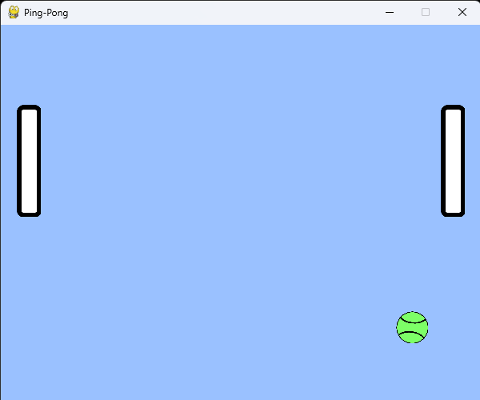
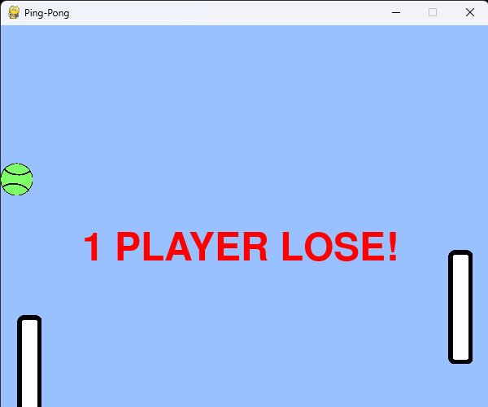
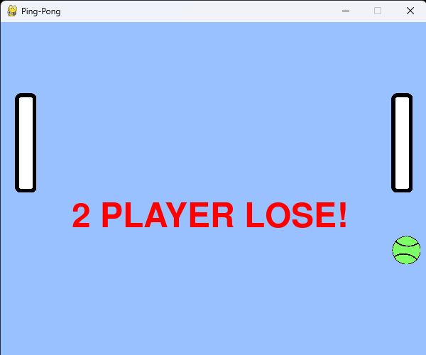

# Ping_Pong

## Механика игры
1. Мяч двигается автоматически

* `Мяч при столкновении с ракеткой или же с верхом или низом окна, отскакивает от них.`

2. Ракетки управляются с помощью клавиатуры:

* `Ракетка слева: W - вверх, s - вниз`
* `Ракетка справа: Стрелка вверх - вверх, стрелка вниз - вниз`

## Реализация игры

* Игра написана на *Python*

* В игре всего три спрайта

* Движение мяча написано в игровом цикле

* В классе для каждой из ракеток своя функция

* В коде 98 строчек

* В игре два условия проигрыша: *Для первого и второго игрока*

